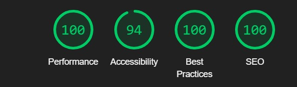

This is an application that showcases the various large language models deployed by organisations and developers alike, created using NextJS for Atlan's Hiring Task | FE Intern.

## Getting Started

You can use this application by accessing the deployed version [here](https://llm-net.vercel.app/).

OR

To run this application locally, you can follow the steps below:

1. Clone the repository

```bash
git clone
```

2. Install the dependencies

```bash
npm install
```

3. Run the development server

```bash
npm run dev
```

4. Open [http://localhost:3000](http://localhost:3000) with your browser to see the result.

## Features

The application has the following features:

- **Theme**: The application has two themes available, `Light` and `Dark`. You can toggle between the two themes by clicking on the moon/sun icon in the navigation bar. Check out both the themes and let me know which one you like more!

- **Home Page**: The home page of the application showcases the various featured large language models as some models deserved to be shown more love than others. From here you can navigate to the models page to explore all the models available in the application or you can click on a featured model to view its details.

- **Models Page**: Click on the _Models_ tab on the Navigation bar and dive into the space for browsing models. This page lists down the various models available on this platform. Here you can find a search bar which can be utilised to search for a specific model by its name. You can also sort the models by Featured, Most Likes and Most Downloads.

- **Model Details Page**: You can click on a model to view its details. Here you can find the model's name, description, use cases, tags and a sample code to use the model. </br>
  _(Note: The sample code may or may not be functional as they are just for demonstration purposes, please refer to the official documentation of the model for the correct usage if it is not a mock example.)_

- **Like Model**: You can like or unlike a model by clicking on the heart icon on the model details page. This will increase or decrease the number of likes for the model.

- **Add Model**: You can add a new model by clicking on the Add Model tab in the navigation bar. Here you can fill in the details of the model and submit it. The model will be added to the list of models and will be available for other users to view.

- **Responsive Design**: The application is fully responsive and can be used on any device, be it a mobile, tablet or desktop.

- **Security Measures**: To safeguard the _"Add Model Form"_ feature against potential injection attacks, I've implemented security protocols. Utilizing a combination of `express-validator` for input validation and `mongo-sanitize` for sanitization, it is ensured that all data entered into the form undergoes checks. This makes sure that the data and application are safe and secure from any potential attacks.

## Tech Stack

- **NextJS**: The application is built using NextJS, a `React framework` that enables server-side rendering and generating static websites for React based web applications.

- **MongoDB**: The data for the models is stored in a MongoDB database. The models are fetched from the database and displayed on the application. New models added by users are also stored in the database.

- **TailwindCSS**: The application uses TailwindCSS for styling. TailwindCSS is a utility-first CSS framework that allows for rapid styling of web applications.

- **React-Icons**: The application uses React-Icons for the icons used in the application.

- **Vercel**: The application is deployed on Vercel, a cloud platform for static sites and serverless functions, best suited for NextJS applications.

- **Express-Validator**: The application uses express-validator for input validation in the _"Add Model Form"_ feature.

## Future Scope

- **User Authentication**: Implement user authentication to allow users to like models and add new models after logging in and also to keep track of the models added by a user.

- **Use a Model**: Add a feature to allow users to use a model directly from the application. This will help users to test the model without having to leave the application.

- **Model Reviews**: Add a feature to allow users to review a model. This will help other users to know the quality of the model and its use cases.

## Performance

The application has been optimized for performance and has a good Lighthouse score.

Some of the statistics are as follows:
</br>
</br>

</br>
</br>


## Conclusion

I hope you enjoy using the application. If you have any feedback or suggestions, feel free to reach out to me. I would love to hear your thoughts on the application. Thank you for taking the time to review my work.
